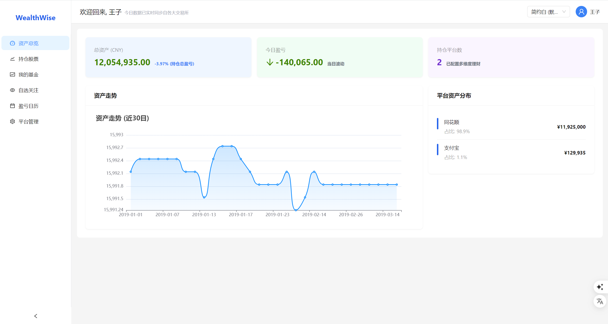
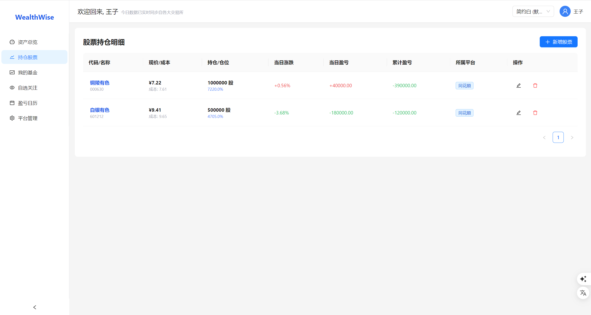
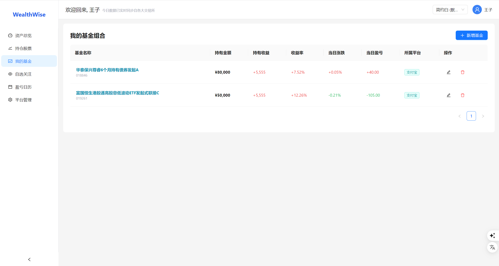
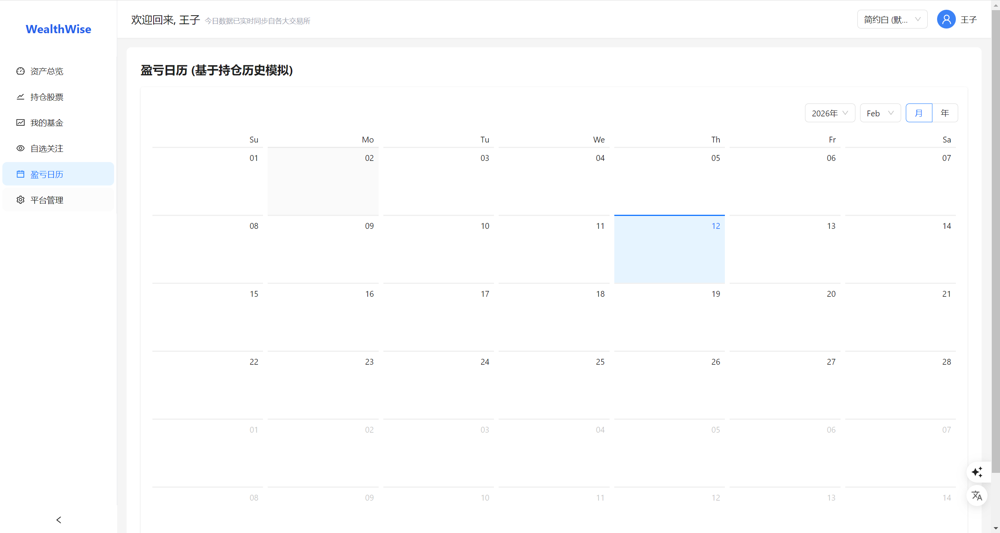
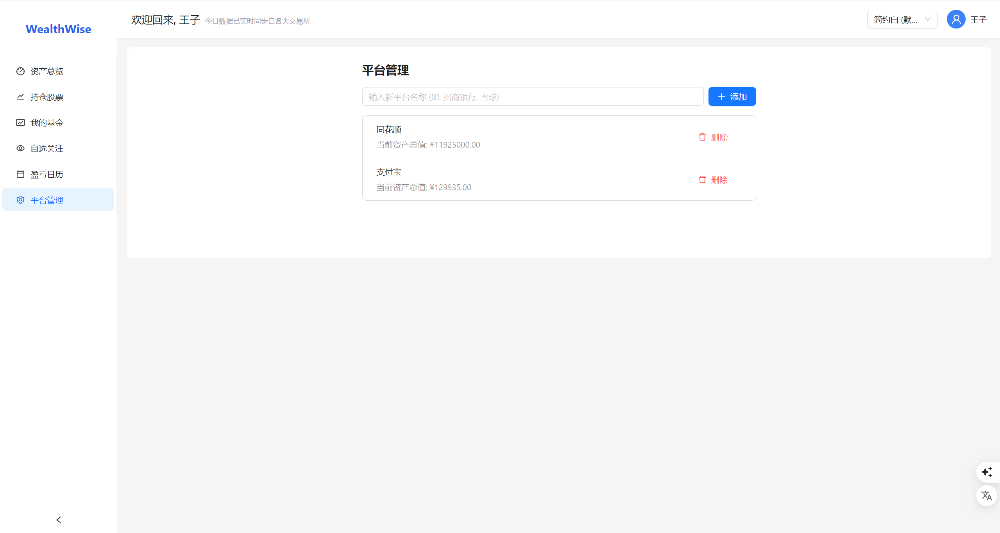

# WealthWise 个人资产管理系统设计文档

### (** 启动前全局搜索0.0.0.0替换为实际IP地址**和数据库密码**！！！)
### (** 启动前全局搜索0.0.0.0替换为实际IP地址**和数据库密码**！！！)
### (** 启动前全局搜索0.0.0.0替换为实际IP地址**和数据库密码**！！！)

## 1. 系统概述
WealthWise 是一个个人财务管理平台，旨在帮助用户集中管理分散在不同平台（如支付宝、同花顺、微信理财通等）的股票和基金资产。系统提供实时的资产净值计算、盈亏分析、图表展示以及日历视图。

## 2. 功能模块设计

### 2.1 用户模块
- **登录/注册**: 支持账号密码登录，默认演示账号 `admin/123456`。
- **个人中心**: 管理个人信息及偏好设置（如主题切换）。

### 2.2 资产管理模块
- **平台管理**: 用户可自定义资产所在的平台（如“招商银行”、“雪球”），支持增删改查。删除平台时会校验是否存在关联资产。
- **股票持仓**:
  - 录入: 代码、名称、成本价、持仓数量、所属平台。
  - 展示: 实时现价、市值、持仓占比、当日涨跌幅、累计盈亏。
  - 交互: 支持搜索自动补全（Mock数据），支持点击查看分时/K线图。
- **基金持仓**:
  - 录入: 代码、名称、持有金额（现值）、持有收益（累计盈亏）、所属平台。
  - 计算: 根据输入的现值和累计收益反推成本，结合实时涨跌幅计算当日盈亏。
  - 展示: 收益率、当日收益、走势图。

### 2.3 首页仪表盘
- **核心指标**: 总资产、今日盈亏（颜色区分红涨绿跌）、持仓平台数。
- **图表**:
  - 资产走势图 (Line Chart)
  - 平台资产分布图 (List/Pie Chart)
- **统计**: 汇总所有平台的资产数据。

### 2.4 盈亏日历
- **日历视图**: 以月历形式展示每日的盈亏金额。
- **视觉反馈**: 盈利显示红色（+），亏损显示绿色（-）。

### 2.5 自选关注
- **实时监控**: 关注股票/基金的实时走势，不涉及持仓计算。
- **迷你图表**: 列表页直接展示简易走势图。

## 3. 技术架构

### 3.1 前端 (Client)
- **框架**: React 18 + Vite
- **UI组件库**: Ant Design 5.0 (支持ConfigProvider主题配置)
- **样式**: TailwindCSS (快速布局)
- **图表**: ECharts (React-ECharts)
- **路由**: React Router v6
- **HTTP客户端**: Axios

### 3.2 后端 (Server)
- **运行时**: Node.js
- **框架**: Express
- **数据库驱动**: mysql2 (Promise wrapper)
- **接口风格**: RESTful API

### 3.3 数据库 (MySQL)
- **Host**: 8.141.121.133
- **Schema**:
  - `users`: 用户表
  - `platforms`: 平台表
  - `assets_stock`: 股票持仓表
  - `assets_fund`: 基金持仓表
  - `watchlist`: 自选表

## 4. 界面风格
系统内置5种主题风格，通过 Ant Design 的 ConfigProvider 和 CSS 变量实现切换：
1. **简约白 (默认)**: 干净清爽，适合日常使用。
2. **极客黑**: 深色模式，适合夜间或专业交易员。
3. **商务蓝**: 稳重专业。
4. **翡翠绿**: 清新护眼。
5. **梦幻紫**: 个性化展示。

## 5. 数据流向
1. 前端发起 API 请求。
2. 后端接收请求，查询 MySQL 数据库获取基础持仓信息。
3. 后端（或前端）调用实时行情接口（本演示中使用 Mock 算法模拟实时波动）。
4. 计算层合并持仓数量与实时价格，得出市值和盈亏。
5. 前端渲染数据和图表。
